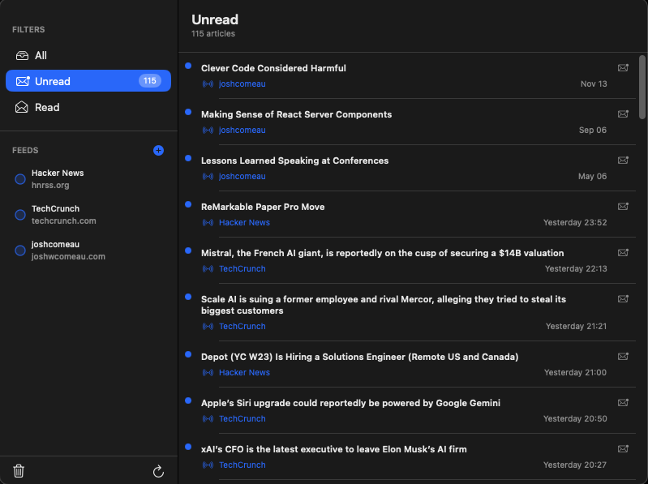

# RSSReader

[](https://github.com/albz/RSSReader/commits/main)
[](https://github.com/albz/RSSReader/releases/latest)
[](https://github.com/albz/RSSReader)
[](https://github.com/albz/RSSReader/stargazers)
[](https://www.reddit.com/r/MacOS/comments/1n98vr6/rssfeeder/)

A simple Menu Bar RSS reader application for macOS.



## Prerequisites

*   macOS with Xcode installed. You can download Xcode from the Mac App Store.

## How to Run

1.  **Clone the repository:**
    ```bash
    git clone <repository-url>
    cd RSSReader
    ```

2.  **Open the project in Xcode:**
    Double-click on the `RSSReader.xcodeproj` file to open the project in Xcode.

3.  **Select a destination (Mac):**
    In the Xcode toolbar, choose "My Mac (macOS)". This is a macOS menu bar app; do not select an iOS simulator.

4.  **Run the app:**
    Click the Run button (play icon) in Xcode or press Cmd+R. For CLI builds, see RUN.md.
