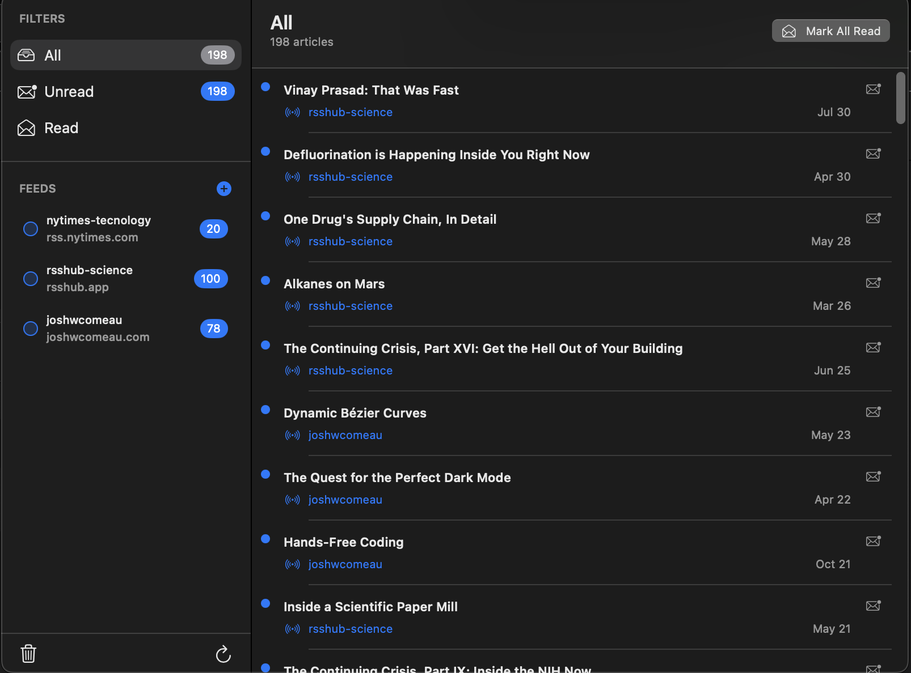

# RSSReader

A simple Menu Bar RSS reader application for iOS.

_old screen, now is better but if you want to see you have to download it!_


## Prerequisites

*   macOS with Xcode installed. You can download Xcode from the Mac App Store.

## How to Run

1.  **Clone the repository:**
    ```bash
    git clone <repository-url>
    cd RSSReader
    ```

2.  **Open the project in Xcode:**
    Double-click on the `RSSReader.xcodeproj` file to open the project in Xcode.

3.  **Select a simulator or device:**
    In the Xcode toolbar, choose the simulator (e.g., "iPhone 15 Pro") or a connected Apple device you want to run the app on.

4.  **Run the app:**
    Click the "Run" button (the play icon) in the Xcode toolbar, or press `Cmd+R`. Or follow the instructions inside `RUN.md` for building locally

